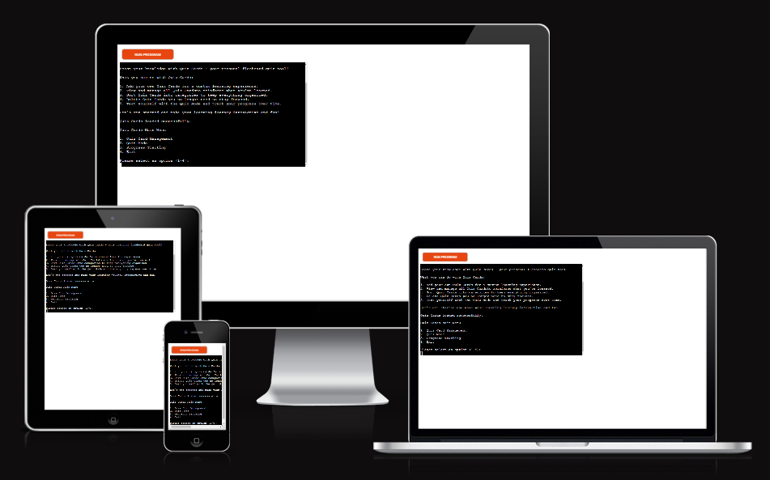
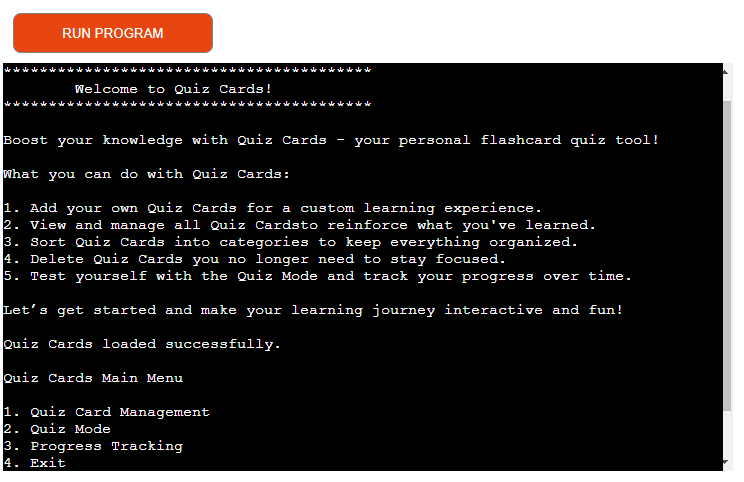
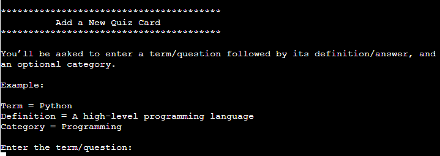
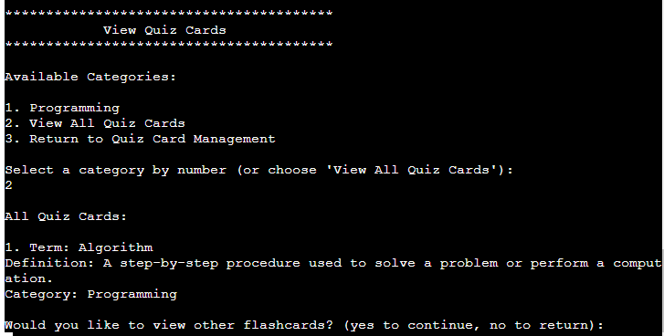
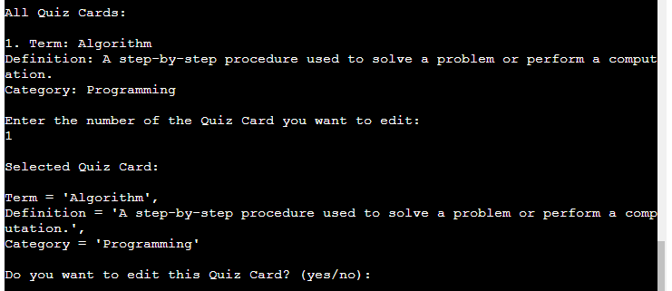
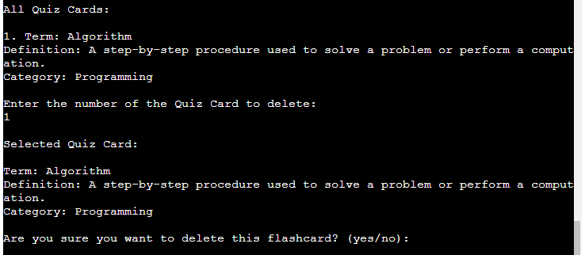
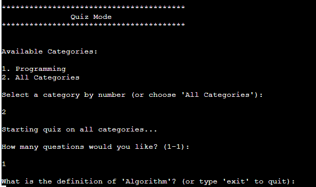
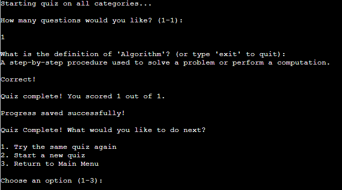
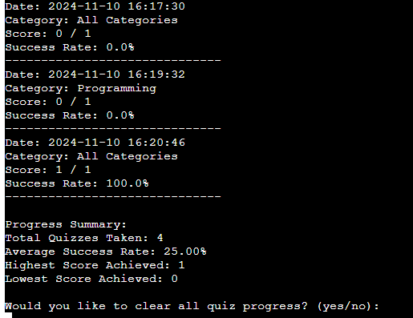
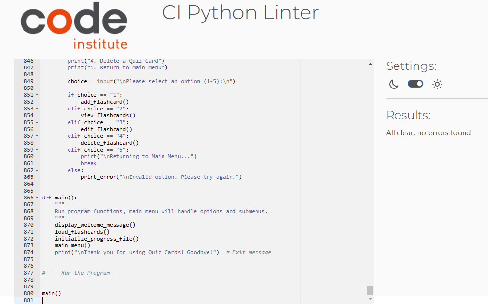

# Quiz Cards

Here's a link to the live version of my [project.](https://quiz-cards-a792b082b856.herokuapp.com/)

Quiz Cards is an interactive command-line flashcard application that enables users to create, manage, and quiz themselves on a set of custom flashcards. Designed for anyone looking to improve their knowledge retention, Quiz Cards allows users to organize flashcards by category, test their understanding through a quiz mode, and track progress over time.

## How it Works

Users can create flashcards by specifying a term, a definition, and an optional category. Flashcards are stored in a JSON file, allowing for easy persistence across sessions. Users can access flashcards by category, edit or delete cards, and quiz themselves with randomly selected flashcards from a chosen category or the entire collection. The progress of each quiz is recorded to enable tracking over time.

## Features

### Existing Features

**Add Quiz Cards**

- Users can create new flashcards by providing a term, definition, and an optional category. Flashcards are automatically saved to a JSON file for persistence.

**View Quiz Cards by Category**

- Users can view quiz cards in a specific category or view all flashcards at once. This feature allows for efficient review of relevant topics.

**Edit and Delete Quiz Cards**

- Users have the ability to modify or delete quiz cards as needed, helping to keep their study set accurate and current.

**Quiz Mode**

- Users can test their knowledge by starting a quiz in a specific category or with all quiz cards. Each quiz session provides feedback on correctness and tracks overall performance.

**Progress Tracking**

- Each quiz session is saved in a JSON file, recording the date, category, score, and success rate. Users can view a summary of their performance history.

### Future Features

**Flashcard Import/Export**
- Add functionality to import or export flashcards to share with others or to backup data.

**Advanced Quiz Customization**
- Provide options for users to set time limits on questions or select specific difficulty levels.

**Enhanced Progress Analysis**
- Generate detailed performance analytics, such as average accuracy per category and improvement trends over time.

## Data Model

The application uses JSON files to store flashcard and progress data. Flashcards are stored in flashcards.json, with each flashcard containing a term, definition, and an optional category. Progress tracking is managed in progress.json, storing data about each quiz, such as date, category, score, total_questions, and success_rate.

## Testing

### Bugs

**Solved Bugs**

- Enhanced Navigation Options
Implemented stricter input handling for confirmation prompts and category selection, reducing the impact of invalid inputs.

- Empty Input Handling: Pressing "Enter" without entering a response in quiz mode originally marked the answer as incorrect.

- Quiz Mode Input Validation
Resolved issue where pressing "Enter" without an answer caused the quiz to move to the next question by adding validation for non-empty input.

- Unexpected Characters in Input: Non-integer inputs in selection prompts could cause errors in earlier versions.

**Remaining Bugs**

- None Identified: All known bugs have been resolved.

### Validator Testing

**PEP8 Validation**

- I passed my code through the Code Institute PEP8 linter and refactored my code after the initial results showed issues such as whitespace and lines that exceeded 79 characters. I passed the code through the linter again to confirm that no issues remained.

**Pylint Validation**

- The code received a score of 9.38/10, with all significant issues addressed.

## Deployment

### Steps for Deployment

## Credits

**Code**

- Code structure and functions were inspired by Python command-line application best practices.

**Content**

- Flashcard content was curated for demonstration purposes from various educational sources.

**Acknowledgments**

- Thanks to Code Institute for providing the template used in this project, and for the lessons featured in the Python Essentials & Love Sandwiches modules.