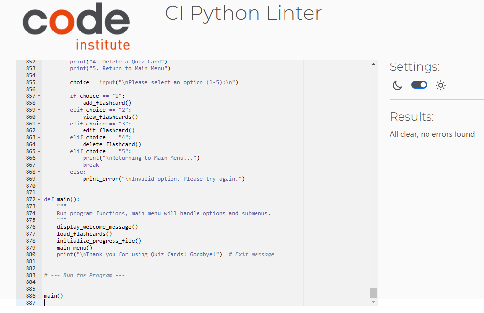

# Quiz Cards

Here's a link to the live version of my [project.](https://quiz-cards-a792b082b856.herokuapp.com/)

Quiz Cards is an interactive command-line flashcard application that enables users to create, manage, and quiz themselves on a set of custom flashcards or Quiz Cards as I refer to them for this app. Designed for anyone looking to improve their knowledge retention, Quiz Cards allows users to organize flashcards by category, test their understanding through a quiz mode, and track progress over time.

## How it Works

Users can create flashcards by specifying a term, a definition, and an optional category. Flashcards are stored in a JSON file, allowing for easy persistence across sessions. Users can access flashcards by category, edit or delete cards, and quiz themselves with randomly selected flashcards from a chosen category or the entire collection. The progress of each quiz is recorded to enable tracking over time.

## Features

### Existing Features

**Add Quiz Cards**

- Users can create new flashcards by providing a term, definition, and an optional category. Flashcards are automatically saved to a JSON file for persistence.

**View Quiz Cards by Category**

- Users can view quiz cards in a specific category or view all quiz cards at once. This feature allows for efficient review of relevant topics.

**Edit and Delete Quiz Cards**

- Users have the ability to modify or delete quiz cards as needed, helping to keep their study set accurate and current.

**Quiz Mode**

- Users can test their knowledge by starting a quiz in a specific category or with all quiz cards. Each quiz session provides feedback on correctness and tracks overall performance.

**Answer Formatting**  

- During quiz mode, users are reminded to pay attention to punctuation and capitalization in their answers. This ensures that responses match the saved flashcard answers accurately. 

**Progress Tracking**

- Each quiz session is saved in a JSON file, recording the date, category, score, and success rate. Users can view a summary of their performance history.

### Future Features

**Quiz Card Import/Export**

- Add functionality to import or export quiz cards to share with others or to backup data.

**Advanced Quiz Customization**

- Provide options for users to set time limits on questions or select specific difficulty levels.

**Enhanced Progress Analysis**

- Generate detailed performance analytics, such as average accuracy per category and improvement trends over time.

**Ignore Punctuation in Quiz Answers**

- Introduce a clean_answer function to preprocess user answers by removing punctuation and excess whitespace. This enhancement would allow users to answer quiz questions without concern for exact punctuation or spacing, improving usability without impacting scoring accuracy.

## Helper Functions

**print_section_title**

- Used to display a section header in the console, making the output more readable.

**print_error**

- A utility function to standardize error messages across the application.

**confirm_action**

- Prompts the user to confirm actions with a "yes" or "no" response, improving input handling.

**get_valid_integer & get_valid_index**

- The `get_valid_integer` and `get_valid_index` functions ensure that user input falls within valid ranges. These enhancements prevent runtime errors and improve user experience by guiding users back to valid options when they make an error.

## Data Model

The application uses JSON files to store quiz card and progress data. Quiz cards are stored in flashcards.json, with each quiz card containing a term, definition, and an optional category. Progress tracking is managed in progress.json, storing data about each quiz, such as date, category, score, total_questions, and success_rate. JSON was selected for its lightweight and human-readable format, making it suitable for storing structured data like flashcards and progress entries in a persistent format for CLI applications.

**Flashcards Data (`flashcards.json`)** 

Each flashcard entry contains:
- `"term"`: The term or question for the flashcard.
- `"definition"`: The corresponding answer or explanation.
- `"category"`: An optional category for organizing flashcards.

**Progress Data (`progress.json`)**

Each quiz entry contains:
- `"date"`: Timestamp of when the quiz was completed.
- `"category"`: The quiz category.
- `"score"`: Number of correct answers.
- `"total_questions"`: Total number of questions in the quiz.
- `"success_rate"`: Percentage score for the quiz session.

## Testing

### Test Cases

**Test Case 1**

- Adding a flashcard with term, definition, and category fields.

**Test Case 2**

- Starting a quiz and answering questions correctly, incorrectly, and with special characters.

**Test Case 3**

- Viewing progress to ensure the progress.json file updates accurately.

**Test Case 4**

- Error handling in cases where inputs exceed limits or contain invalid characters.

### Solved Bugs

**Enhanced Navigation Options**

- Implemented stricter input handling for confirmation prompts and category selection, reducing the impact of invalid inputs.

**Empty Input Handling**

- Pressing "Enter" without entering a response in quiz mode originally marked the answer as incorrect.

**Quiz Mode Input Validation**

- Resolved issue where pressing "Enter" without an answer caused the quiz to move to the next question by adding validation for non-empty input.

**Unexpected Characters in Input**

- Non-integer inputs in selection prompts could cause errors in earlier versions.

### Remaining Bugs

**None Identified**

- All known bugs have been resolved.

### Validator Testing

**PEP8 Validation**

- I passed my code through the Code Institute PEP8 linter and refactored my code after the initial results showed issues such as whitespace and lines that exceeded 79 characters. I passed the code through the linter again to confirm that no issues remained.

**Pylint Validation**

- Tested via the GitPod terminal. The code received a score of 9.38/10, with all significant issues addressed.

## Deployment

This project was deployed on Heroku via the Code Institute's mock terminal.

### Steps for Deployment

- Create a new app on Heroku.

- Add the Python and NodeJS buildpacks in that order.

- Add a config var called PORT with the value 8000.

- In the Deploy tab of the Heroku dashboard, under Deployment method, select GitHub and search for the GitHub repository to connect.

- In the Overview tab of the Heroku dashboard, confirm that web dyno is toggled on in the Dyno Formations section.

- In the Manual Deploy section, select the main branch and click Deploy Branch.

## Credits

**Code**

- Code structure and functions were inspired by Python command-line application best practices.

**Libraries Used**

- **json**: For data serialization.

- **os**: To manage file paths and verify file existence.

- **random**: For random selection of quiz cards during quizzes.

**Content**

- Quiz card content was curated for demonstration purposes from various educational sources.

**Acknowledgments**

- Thanks to Code Institute for providing the template used in this project, and for the lessons featured in the Python Essentials & Love Sandwiches modules.